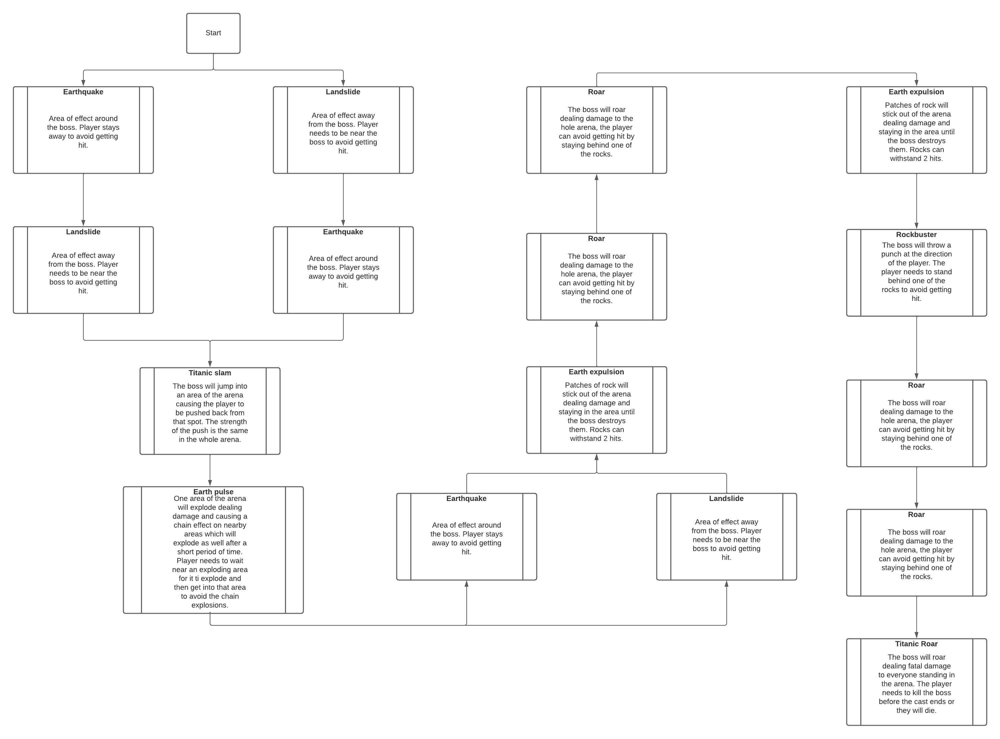

# IAV22-BlázquezMartín

La idea descrita va a ser desarrollada por un grupo de dos integrantes: Samuel Blázquez Martín y Miguel Hernández García.

Partiremos de un proyecto de Unity en blanco y desarrollaremos a partir de ahí una batalla de jefe final.
En la escena habrá un jugador que podrá moverse en un escenario 3D y atacar a un enemigo mientras esté a un rango considerable, pudiendo atacar a distancia.
También habrá un boss que tendrá una barra de vida y una máquina de estados. Emplearemos Bolt para implementar esta máquina de estados en Unity. El boss realizará una serie de ataques dependiendo del tiempo transcurrido en el encuentro, su barra de vida y distintos parámetros como la posición del jugador.

El jugador deberá de moverse por el escenario evitando los ataques del boss y disminuyendo su vida. (Para más claridad la barra de vida del boss será mostrada continuamente en pantalla).

En el caso de que el jugador reciba demasiado daño, este perderá la partida.

Es posible que se añadan a la escena más enemigos con comportamientos simples de seguimiento del jugador y ataque si el diseño de la batalla lo requiere.

Ambos integrantes se encargarán del desarrollo de la máquina de estados y acciones del boss, nos encargaremos de describir en la documentación las partes que han sido desarrolladas por cada uno de los integrantes.

# Descripción en detalle de la solución a implementar

A) Escena en vista perspectiva 3D en 3ª persona con un escenario en forma de cuadrado. Camara con movimiento horizontal y zoom.

B) Delimitar la zona con un muro de fuego que haga insta-kill.

C) Jugador con movimiento mediante WASD sin posibilidad de salto. El jugador podrá moverse con libertad por el escenario a una velocidad fija. También podrá atacar al Boss presente en la sala pulsando la Barra Espaciadora. En el momento en el que el jugador pulse la barra espaciadora deberá de quedarse quieto durante 3 segundos o el ataque se cancelará. Si el jugador ha esperado 3 segundos después de pulsar la Barra espaciadora le hará daño, reflejándose en la interfaz.

D) Interfaz que muestre todo lo mencionado, desde las vidas del jugador y el bos, hasta las barras de casteo de ambos

E) Creación de Boss e implementación de una maquina de estados en Bolt que realizará un patrón de ataques en orden con ciertas variaciones. Las habilidades del Boss se especificarán más adelante

F) El Boss realizará siempre los mismos ataques en el mismo orden, sin embargo algunos ataques tendrán variaciones diferentes que cambiarán significativamente su funcionamiento. El jugador deberá de identificar a tiempo el tipo de ataque para evitar recibir daño. Antes de realizar un ataque el nombre del ataque será mostrado en pantalla junto a una barra de progreso. Cuando la barra de progreso finalice el ataque será realizado. Todos los ataques durante este tiempo mostrarán también un indicador visual en el mapa para ayudar al jugador a identificar las zonas donde ese ataque impactará.

El jugador puede recibir un total de 4 golpes durante la partida, al quinto golpe morirá y tendrá que empezar de nuevo.

# Diseño del Boss

El Boss tiene como tema principal la Roca y empleará distintos ataques utilizando su entorno y su fuerza bruta para acabar con el jugador.

Estos ataques incluyen:

- Ataques localizados en zonas específicas del escenario que hacen daño al jugador.

- Ataques que empujarán al jugador desde su punto de origen.

- Ataques que el jugador debe de evitar cubriéndose en rocas que irán apareciendo por el mapa.



# Pseodocódigo

Realizaremos una estructura de acciones que tendrá un funcionamiento parecido al siguiente:

```
timeTimerStarted: int = currentTime
actualTime: int = currentTime

castDuration: int = 5000

while timeTimerStarted + castDuration > actualTime:
  # Actualizamos la barra de progreso del cast
  progressBar.setProgress(actualProgress)

# Hacemos la acción cuando finalice
accion.do()

```

Realizaremos un metodo por cada acción a realizar, estas acciones instanciarán representaciones visuales del ataque y un trigger que aplicará daño al jugador.

# Referencias

AI for games Third Edition by Ian Millington

https://unity.com/es/products/unity-visual-scripting

Final Fantasy XIV

Furi
